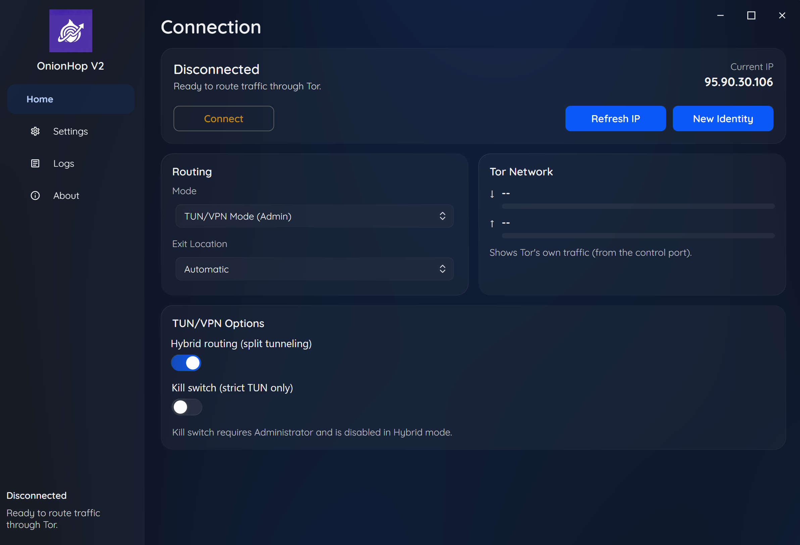

# OnionHop V2

<div align="center">
  
</div>

<div align="center">
  <a href="assets/onionhop-v2-ui.png"></a>
</div>

<div align="center">
  <a href="https://github.com/center2055/OnionHop/releases">
    
  </a>
  <a href="https://ko-fi.com/center2055">
    
  </a>
</div>

**OnionHop V2** is a modern desktop app for **Windows + macOS** that routes your traffic through **Tor** using either:

- **Proxy Mode (recommended):** starts Tor locally and sets the system proxy to Tor's local SOCKS5 endpoint.
- **TUN/VPN Mode (Admin):** starts a system-wide tunnel via **sing-box** (and **Wintun** on Windows).

V2 adds a redesigned UI and stronger routing controls (including **per-app split tunneling** in Hybrid mode).

> **Disclaimer**
> OnionHop is provided "as-is". Tor usage can be illegal or restricted in some jurisdictions. You are responsible for complying with local laws and regulations.

---

## Getting Started (User)

1) Install  
   - Download the latest release from [Releases](https://github.com/center2055/OnionHop/releases).
   - Run the Windows installer (`OnionHop-Setup-<version>.exe`).
   - On macOS, open the DMG and move `OnionHop.app` to `/Applications`, or install with `brew install --cask center2055/onionhop/onionhop`.

2) Choose a mode  
   - **Proxy Mode (no admin):** Best compatibility for proxy-aware apps.  
   - **TUN/VPN Mode (admin):** System-wide routing via sing-box; on Windows this uses Wintun. Needed for apps that ignore proxy settings.

3) Connect  
   - Optionally choose an **Exit Location** (and optional **Entry Node** in Advanced settings).
   - Enable **Bridges** if your network blocks Tor (snowflake/obfs4/meek/webtunnel/custom).
   - Click **Connect**.

Notes
- Kill Switch works only in strict TUN (Hybrid off) and needs admin rights to add/remove firewall rules.  
- `.onion` sites require a Tor-aware client (Tor Browser recommended) or SOCKS remote DNS (e.g., Firefox "Proxy DNS when using SOCKS v5").  

---

## Startup activity and permissions

OnionHop performs a few background tasks before you click **Connect** so the UI can show status immediately and the app is ready when you do connect.

On startup, OnionHop may:

- look up your current public IP status
- refresh the Tor relay country list from Onionoo
- fetch GitHub release/changelog metadata for update and About-page surfaces
- ensure Tor/pluggable transport dependencies exist; on first run this can download Tor components

### What permissions are needed?

- **Network access:** used for IP checks, Onionoo country data, GitHub release metadata, and dependency downloads
- **Administrator / system password:** only needed for features that change system networking, such as **TUN/VPN mode**, **kill switch**, or system **DNS/proxy** changes
- **Folder access:** used to store settings, startup logs, runtime data, downloaded Tor/VPN binaries, bridge cache files, and any log export location you explicitly choose

In normal use, OnionHop mainly works inside its own application-data/runtime folders plus any destination you choose when exporting logs.

---

## Features (Core)

- Tor routing (SOCKS5)
- System proxy mode (no admin required)
- TUN/VPN mode via sing-box (Wintun on Windows; admin required)
- Hybrid routing + split tunneling (Hybrid mode)
- Tor bridges / pluggable transports (automatic, obfs4, snowflake, conjure, meek-azure, webtunnel, custom)
- Kill Switch (strict TUN only)
- Start with Windows (optional) + start minimized
- Minimize-to-tray option on close
- Auto-update checks via GitHub releases
- Logs (App + DNS) and diagnostics
- Optional Discord status + launch-page automation

---

## Modes explained

### 1) Proxy Mode (Recommended)
- Starts Tor locally.
- Sets Windows proxy to `socks=127.0.0.1:9050`.
- No admin required.

### 2) TUN/VPN Mode (Admin)
- Starts Tor + sing-box.
- Routes traffic at OS level.
- Requires Administrator / root.

### Hybrid (Split tunneling)
- Only applies in **TUN/VPN Mode**.
- Lets you route selected apps through Tor while keeping others direct.

---

## Settings storage

OnionHop stores settings and runtime data in the OS application-data folders.

Examples:

- `%AppData%\\OnionHop\\settings.json`
- `%LocalAppData%\\OnionHop\\startup.log`

On macOS, the same files live under the user's Library application-data directories.

---

## Repository layout

- `OnionHop/` - OnionHop V2 (Avalonia UI)
- `OnionHop/src/OnionHopV2.Cli` - OnionHop V2 command-line interface
- `onionhop-dynamic-wallpaper/` - OnionHop Dynamic Wallpaper (Tauri 2 + Rust + Vite)

---

## Building (Dev)

### Build the V2 installer (Windows)

Prereqs:
- .NET SDK 9
- Inno Setup 6

Build:

```powershell
powershell -NoProfile -ExecutionPolicy Bypass -File installer/build-installer-v2.ps1
```

Output:
- `installer/output/OnionHop-Setup-<version>.exe`

### Build the V2 portable ZIP (Windows)

Build:

```powershell
powershell -NoProfile -ExecutionPolicy Bypass -File installer/build-portable-v2.ps1
```

Output:
- `installer/output/OnionHopV2-Portable-<version>-win-x64.zip`

### Build the CLI installer (Windows)

Build:

```powershell
powershell -NoProfile -ExecutionPolicy Bypass -File installer/build-installer-cli.ps1
```

Output:
- `installer/output/OnionHop-CLI-Setup-<version>.exe`

### Build the CLI portable ZIP (Windows)

Build:

```powershell
powershell -NoProfile -ExecutionPolicy Bypass -File installer/build-portable-cli.ps1
```

Output:
- `installer/output/OnionHopCLI-Portable-<version>-win-x64.zip`

### Run CLI (Dev)

```powershell
dotnet run --project "OnionHop/src/OnionHopV2.Cli" -c Release
```
