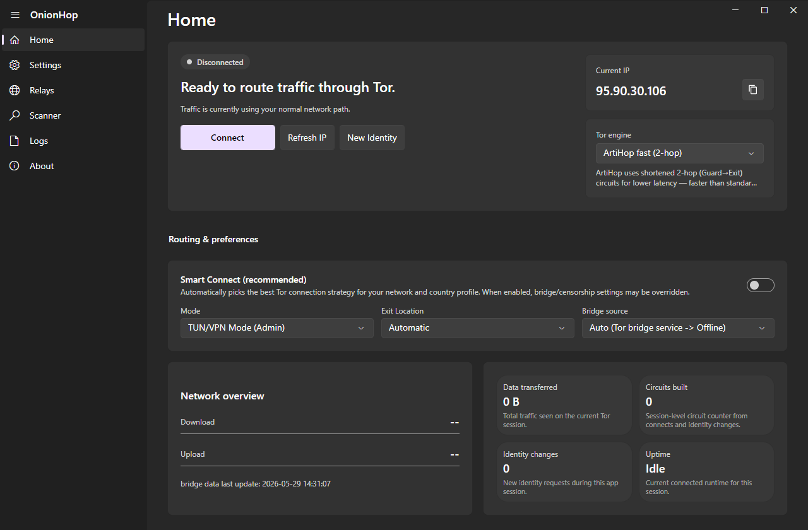

# OnionHop V3

<div align="center">
  
</div>

<div align="center">
  <a href="assets/onionhop-v3-ui.png"></a>
</div>

<div align="center">
  <a href="https://github.com/center2055/OnionHop/releases">
    
  </a>
  <a href="https://ko-fi.com/center2055">
    
  </a>
</div>

**OnionHop V3** is a modern Windows desktop app that routes your traffic through **Tor**, with a redesigned native Windows 11 / Fluent interface and a chromeless, integrated title bar. It can run Tor as a local SOCKS proxy or as a system-wide tunnel, scan and pick working bridges for censored networks, and even let you volunteer as a Snowflake proxy.

> **Disclaimer**
> OnionHop is provided "as-is". Tor usage can be illegal or restricted in some jurisdictions. You are responsible for complying with local laws and regulations.

---

## What's new in V3

- **Redesigned UI** — native Windows 11 / Fluent look (FluentAvalonia), light/dark/follow-system themes, an accent picker, and an integrated chromeless title bar (no separate OS title bar, still fully draggable).
- **Three Tor engines** — choose per connection:
  - **Classic** (`tor.exe`): full control — bridges, country/entry/exit pinning, and control-port **New Identity** (NEWNYM).
  - **Arti**: the Rust Tor implementation.
  - **ArtiHop (2-hop)**: shortened Guard→Exit circuits for lower latency (faster than standard 3-hop, with correspondingly weaker anonymity), now with live **New Identity** support.
- **Bridge Scanner** — fetch and TCP-test bridges of **every transport type** (obfs4, webtunnel, vanilla, snowflake, meek, conjure), see color-coded reachability/latency, and export or one-click apply the bridges that actually work on your network. Fronted transports (snowflake/meek/conjure) are tested by probing their broker/front host.
- **Volunteer as a Snowflake proxy** — help censored users reach Tor, straight from Settings.
- **Decoupled system-proxy toggle** — turn the Windows system proxy off while Tor stays connected.
- **Stronger leak protection** — optional full DNS-over-Tor so system DNS doesn't bypass Tor in Proxy Mode, plus an in-app WebRTC/UDP privacy notice.
- **Extra bridge source** — an additional, censorship-resistant [bridge collector](https://github.com/center2055/OnionHop-Bridges-Collector) endpoint is used as a fallback when the official bridge service is unavailable.

---

## Getting started

1. **Install**
   - Download the latest release from [Releases](https://github.com/center2055/OnionHop/releases).
   - Run the Windows installer (`OnionHop-Setup-v3.exe`). It is self-contained — the .NET 9 runtime is bundled, so there's nothing else to install.

2. **Choose a mode**
   - **Proxy Mode (recommended, no admin):** starts Tor locally and points the Windows system proxy at Tor's local SOCKS5 endpoint. Best compatibility for proxy-aware apps.
   - **TUN/VPN Mode (admin):** system-wide routing via **sing-box** + **Wintun**; needed for apps that ignore proxy settings. Leak-resistant (DNS through Tor, UDP blocked).

3. **Connect**
   - Optionally pick a **Tor engine**, an **Exit Location** (and an **Entry Node** in Advanced settings).
   - Enable **Bridges** if your network blocks Tor — or open the **Scanner** to find bridges that work in your region.
   - Click **Connect**.

Notes
- `.onion` sites require a Tor-aware client (Tor Browser recommended) or SOCKS remote DNS (e.g., Firefox "Proxy DNS when using SOCKS v5").
- Bridges, country/relay pinning and control-port New Identity require the **Classic** engine; Arti/ArtiHop run as a SOCKS proxy runtime.

---

## Startup activity and permissions

On startup OnionHop runs a few background tasks so the UI shows status immediately and is ready when you connect. It may:

- look up your current public IP status,
- refresh the Tor relay country list (Onionoo),
- fetch GitHub release/changelog metadata for update and About surfaces,
- ensure Tor / pluggable-transport dependencies exist (first run can download Tor components).

### Permissions

- **Network access** — IP checks, Onionoo country data, GitHub release metadata, bridge sources, and dependency downloads.
- **Administrator** — only for features that change system networking: **TUN/VPN mode**, **kill switch**, or system **DNS/proxy** changes.
- **Folder access** — store settings, startup logs, runtime data, downloaded Tor/VPN binaries, bridge cache, and any log export location you choose.

---

## Tor engines

| Engine | Hops | Admin | Bridges / pinning / NEWNYM | Notes |
| :--- | :--- | :--- | :--- | :--- |
| **Classic** (`tor.exe`) | 3 | no (Proxy) | yes | Most features; recommended for censorship + control |
| **Arti** | 3 | no | no | Rust Tor implementation (SOCKS runtime) |
| **ArtiHop** | 2 (Guard→Exit) | no | New Identity only | Lower latency, weaker anonymity |

---

## Modes explained

### Proxy Mode (recommended)
Starts Tor locally and sets the Windows proxy to Tor's SOCKS5 endpoint. No admin required. You can toggle the system proxy off without disconnecting Tor.

### TUN/VPN Mode (admin)
Starts Tor + **sing-box** and routes traffic at the OS level (Wintun on Windows). Requires Administrator. Most leak-resistant.

### Hybrid (split tunneling)
Only in TUN/VPN Mode — route selected apps through Tor while others stay direct.

---

## Settings storage

OnionHop stores settings and runtime data in the OS application-data folders, e.g.:

- `%AppData%\OnionHop\settings.json`
- `%LocalAppData%\OnionHop\startup.log`

---

## Building (Dev)

Prerequisites:
- .NET SDK 9
- Inno Setup 6 (for the installer)
- *(optional)* Rust toolchain to build the **ArtiHop** engine, and Go to build the **Snowflake proxy** / **webtunnel** client — these are fetched/built by `download-deps.ps1`; if a toolchain is missing, that engine/feature is simply skipped.

Fetch runtime dependencies (Tor, pluggable transports, sing-box, xray, Wintun, ArtiHop, Snowflake proxy):

```powershell
powershell -NoProfile -ExecutionPolicy Bypass -File download-deps.ps1
```

Build the V3 installer (self-contained, Windows x64):

```powershell
powershell -NoProfile -ExecutionPolicy Bypass -File installer/build-installer-v3.ps1
```

Output:
- `installer/output/OnionHop-Setup-v3.exe`

Run the app from source:

```powershell
dotnet run --project OnionHop/src/OnionHopV2.App -c Release
```

The ArtiHop 2-hop engine is built from its own public repo, [center2055/ArtiHop](https://github.com/center2055/ArtiHop) — only the compiled binary is bundled; its source is not vendored.
